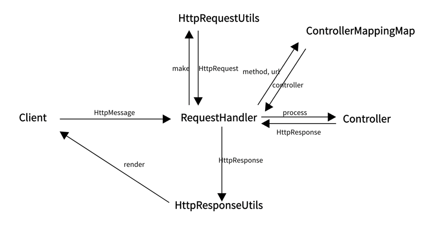
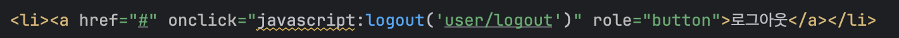
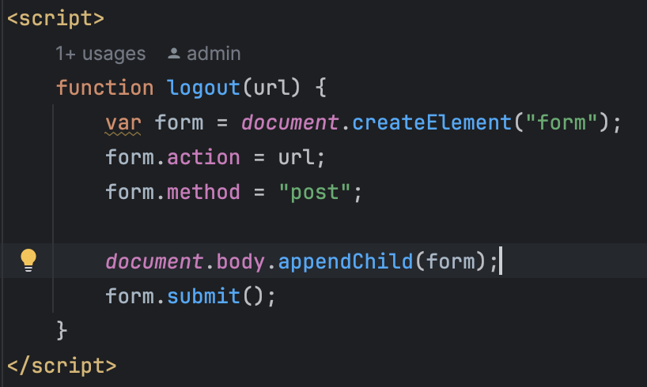

# java-was-2023

Java Web Application Server 2023

## 프로젝트 정보 

이 프로젝트는 우아한 테크코스 박재성님의 허가를 받아 https://github.com/woowacourse/jwp-was 
를 참고하여 작성되었습니다.

## 전체 구조


1. Client가 HttpMessage를 보내면 Webserver에서 생성된 thread를 통해 RequestHandler로 진입 
2. HttpRequestUtils에서 HttpMessage에 대한 parsing을 진행하고 HttpRequest 객체를 만들어서 반환
3. RequestUrl을 통해 ControllerMappingMap에 등록된 Controller를 찾아서 반환
4. HttpRequestUtils에서 반환된 HttpRequest와 RequestHandler에서 자체적으로 생성한 HttpResponse를 Controller에 넘겨주고 컨트롤러 자체 로직을 실행, Controller에서는 클라이언트에 반환할 값이 세팅된 HttpResponse 객체를 반환
5. 반환된 HttpResponse 객체를 HttpResponseUtils에 넘겨주고 해당 클래스에서 render를 통해 Client에게 Http 응답 메시지를 전송

## 클래스 별 역할
### WebServer
- Java ExecutorService
  - 병렬 작업 시 여러 개의 작업을 효율적으로 처리하기 위해 제공되는 JAVA 라이브러리
  - 쓰레드를 직접 생성하고 제거하는 작업이 불필요
  - ExecutorService에 Task만 지정해주면 알아서 쓰레드 풀을 통해 Task 실행, 관리
     ```angular2html
      executorService.submit(new RequestHandler(connection));
     ```
  - Task 관리 방식 : 쓰레드 풀의 쓰레드 수보다 Task가 많으면 Task는 큐에 저장, 이후 순차적 실행
  - FixedThreadPool을 사용하여 톰캣의 최대 쓰레드 풀 사이즈인 200으로 설정

### HttpRequest, HttpResponse
- Http 요청과 응답 객체 
- 필드와 getter, setter로만 구성

### HttpRequestUtils
- HttpRequest Message를 Parsing하여 HttpRequest 객체에 저장하는 역할 수행
- RequestLine, Header, Body Parsing 메소드 단위로 진행

### HttpResponseUtils
- Enum으로 선언된 HttpResponseStatus를 가지고 HttpResonseLine을 반환하는 함수 제공
- OutputStream을 가지고 HttpResponse를 실제 Http 응답으로 보내는 역할 수행

### ControllerMappingMap
- Http 요청의 Method와 URL을 해당 컨트롤러와 매핑

# 공부 내용 정리
## JAVA ExecutorService

### About ExecutorService

- 병렬 작업 시 여러 개의 작업을 효율적으로 처리하기 위해 제공되는 JAVA 라이브러리
- Thread를 직접 생성하고 제거하는 작업이 불필요
- Executor Service에 Task를 지정해주면 쓰레드풀을 통해 알아서 실행하고 관리
- Task의 관리 방식
    - Queue
    - 쓰레드 풀의 쓰레드 수보다 Task가 많으면 큐에 저장되었다가 쓰레드가 할당되면 순차적 수행

### 사용

1. ThreadPoolExecutor로 객체 생성 

```java
ExecutorService executorService = new ThreadPoolExecutor(...);
```

1. Executor 클래스에서 제공하는 Static Factory Method 사용

```java
ExecutorService executorService = Executors.newFixedThreadPool(int nThreads);
```

- CachedThreadPool
    - 쓰레드를 캐싱
    - 쓰레드 제한 없이 생성 & 해당 쓰레드 60초간 작업 없으면 Pool 제거
    - 작업이 계속적으로 쌓이는 환경에서 쓰레드 수 폭발적 증가할 가능성
- FixedThreadPool
    - 고정된 개수의 쓰레드 풀
- SingleThreadExecutor
    - 한 개의 쓰레드로 작업 처리
    - race-condition 같은 부분 알아서 처리

### ExecutorService에 Task 할당

- ThreadPool의 쓰레드들이 각자 본인의 Task 수행, 개발자는 쓰레드 생명주기 관리 필요 X
- Method
    - execute()
    - submit()
    - invokeAny()
    - invokeAll()

### 종료

- Method
    - shutdown() : 실행 중인 모든 Task가 수행되면 종료
    - shutdownNow() : 실행 중인 쓰레드들 즉시 종료하려 시도, 모든 쓰레드 동시 종료 보장X, 실행되지 않은 Task 반환

## Http Request Body Parsing

### BufferedReader read vs readLine

- readLine
    - 한 줄씩 읽어옴
    - 각 줄을 문자열로 변환하는 overhead
    - 내부적 버퍼 사용
- read
    - 바이트 단위로 읽어옴
    - 별도의 문자열 변환 필요 X
    - 직접 버퍼 관리가 가능, 성능 최적화

- Http Header처럼 각 헤더가 한줄로 되어 있는 경우 readLine으로 처리하기 좋음. 하지만 Body처럼 큰 데이터의 경우 readLine에서는 한 줄을 읽을 때까지 block되기 때문에 비효율적임.
- 그래도 Http Body가 텍스트 or 멀티파트 형태인 경우 readLine 사용을 고려해볼만 함.

## 쿠키와 세션을 이용한 로그인 방식

1. MemberLoginController에서 userId와 password를 받아서 MemberLoginService에 넘긴다.
2. MemberLoginService는 DB에서 userId가 있는지, 있다면 클라이언트에서 입력된 비밀번호와 일치하는지 확인하여 검증에 문제가 없다면 findUser 객체를 문제가 생겼다면 null을 반환한다.

    ```java
    public class MemberLoginService {
        public User login(String userId, String password) {
    
            User findUser = Database.findUserById(userId);
    
            if (findUser == null) {
                return null;
            }
    
            if (!findUser.getPassword().equals(password)) {
                return null;
            }
    
            return findUser;
        }
    }
    ```

3. MemberLoginController는 MemberLoginService로부터 반환받은 User객체가 null이라면 인증에 실패한 것이므로 login_failed 화면으로 redirect 시키고 만약 User가 반환된다면 SessionManager에게 해당 User에 대한 세션 생성을 요청한다.
4. SessionManager에서는 랜덤한 세션id를 생성하고 sessionRepository에 <세션id, User> 매핑을 저장한 후 세션id를 컨트롤러에 반환한다.

    ```java
    private static Map<String, User> sessionRepository = new ConcurrentHashMap<>();
    
    // 로그인 성공한 유저에게 세션 id 발급
    public String createSession(User user) {
        String sessionId = UUID.randomUUID().toString();
        sessionRepository.put(sessionId, user);
        return sessionId;
    }
    ```

5. Controller에서는 SessionManager로부터 받은 sessionId를 HttpResponse 헤더에 “set-cookie : sid=sessionId; Path=/” 형식으로 추가하여 클라이언트에게 반환한다.
6. 클라이언트는 서버에서 온 set-cookie 헤더를 보고 해당 쿠키를 브라우저 쿠키 저장소에 저장하고 Path가 “/”이므로 해당 도메인의 모든 http 요청에 “Cookie : sid=sessionId” 헤더를 넣어서 요청한다.
7. 서버에서는 HttpRequest의 쿠키에 담겨있는 sessionId를 가져와서 해당 sessionId에 매핑되는 User가 있다면 로그인 상태로, 없다면 로그아웃 상태로 판단한다.

    ```java
    // 세션 아이디로 유저 조회
    public User getUserBySessionId(HttpRequest request) {
        String cookie = request.getHeaders().get("Cookie");
        if (cookie != null) {
            String[] tokens = cookie.split("=");
            return sessionRepository.get(tokens[1]);
        }
        return null;
    }
    ```


## 로그아웃 기능

- 로그아웃의 테스트를 위해서 index.html에 간단한 자바스크립트 로직을 추가하였다. 해당 로그아웃은 index.html에서만 동작하도록 구현하였다.

  
  

- 로그아웃 시 “user/logout” URL로 POST 요청을 보내서 MemberLogoutController가 동작하고 이는 SessionManager.deleteSession(HttpRequest request) 메서드를 호출한다.

    ```java
    public void deleteSession(HttpRequest request) {
        String cookie = request.getHeaders().get("Cookie");
        String[] tokens = cookie.split("=");
        sessionRepository.remove(tokens[1]);
    }
    ```

- 해당 메서드에서는 Cookie로 넘어온 sessionId를 key로 sessionRepository에 저장되어 있는 매핑을 제거한다 → 이렇게 하면 나중에 getUserBySessionId가 호출되었을 때 매핑이 존재하지 않아 null이 반환되고 서버에서는 이를 로그아웃 상태로 정의한다.

### 로그아웃에 POST를 이용하는 이유

서버 측에 요청할 때 특별한 데이터를 담지 않는데 GET을 사용하면 안되는가?

- prefetch라는 기술의 영향을 받아 비정상 동작 가능, GET은 본질적으로 컨텐츠 반환에 사용해야 함
  - prefetch : 사용자를 위해 GET 링크를 미리 가져와서 사용자가 해당 링크를 클릭했을 시 즉시 제공하여 페이지 로딩 시간을 줄이는 프로세스
  - 따라서, 페이지에서 링크를 미리 가져오려고 시도하면서 실수로 사용자를 로그아웃 시킬 수 있음
   
