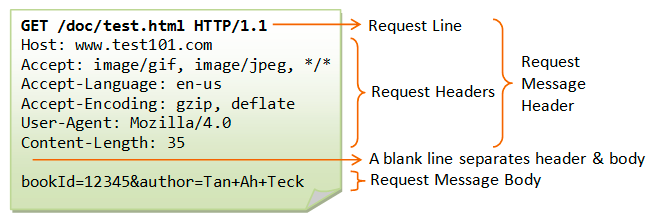
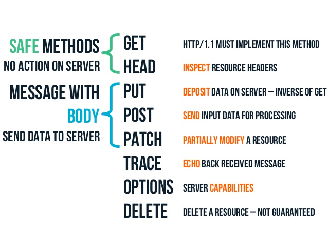
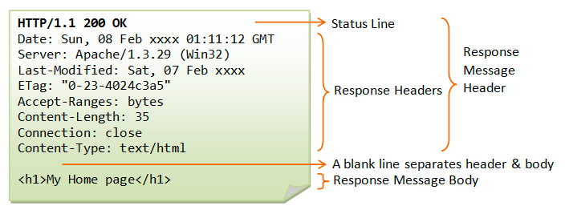
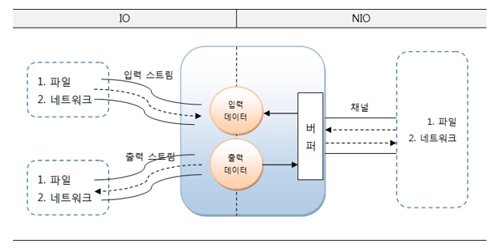

# java-was-2023

Java Web Application Server 2023

## 프로젝트 정보 

이 프로젝트는 우아한 테크코스 박재성님의 허가를 받아 https://github.com/woowacourse/jwp-was 
를 참고하여 작성되었습니다.

---
<details>
    <summary><b>Step 1 - index.html 응답</b></summary>

### 1. 학습 목표
- HTTP를 학습하고 학습 지식을 기반으로 웹 서버를 구현한다.
- Java 멀티스레드 프로그래밍을 경험한다.
- 유지보수에 좋은 구조에 대해 고민하고 코드를 개선해 본다.

### 2. 기능요구사항
- 정적인 html 파일 응답
- HTTP Request 내용 출력
-  Concurrent 패키지를 사용하도록구조 변경

### 3. 학습 내용
#### 1. HTTP Request Header

- HTTP 요청 구조
>
> - 첫줄(Request Line)이 큰 의미를 지닌다.
> - 첫 줄은 공백을 기준으로 3개의 부분으로 나뉘며 각각 Metho, path, HTTP version이다.
> - path의 ? 뒷부분을 query string이라 한다.

- Method
> 
> - GET은 Select적인 성향을 갖습니다. CRUD의 R에 해당합니다.
> - POST는 서버의 값이나 상태를 바꾸기 위해 사용합니다. CRUD의 C에 해당합니다.

#### 2. WAS 생애주기

- connection
> 1. WebServer 클래스에서 지정된 포트 번호로 ServerSocket을 생성한다.
> 2. accept()로 클라이언트의 요청이 들어올 때 까지 대기하고, 연결 요청이 오면 클라이언트와의 통신을 위한 소켓을 생성한다.
> 3. 클라이언트 요청이 들어오면, RequestHandler 클래스에 처리를 위임한다.
> 4. connection으로부터 InputStream, OutputStream을 생성하여 입출력 스트림을 생한다.
> 5. `try-with-resources` 구문을 통해 try 구문을 빠져나갈 때 자동으로 `AutoCloseable` 인터페이스를 구현한 리소스를 닫아준다.
>   - 해당 구문으로 인해 입출력 스트림도 함께 닫힌다.
>   - 입출력 스트림이 닫힐 때 자동으로 소켓도 함께 닫힌다. 

- dos
> 1. DataStream에 매개변수로 OutputStream을 전달하여 객체 생성한다.
> 2. writeBytes() 메서드로 헤더와 바디의 내용을 담는다.
> 3. flush() 메서드로 출력 스트림 버퍼의 내용을 내보내고 버퍼를 비운다.
> 4. `try-with-resources` 구문을 통해 try 구문을 빠져나갈 때 자동으로 out의 close()를 호출하고 dos가 자동으로 닫힌다.

#### 3. HTTP Response Header (200)
- HTTP 응답 구조
> 
> - 첫줄(Status Line)에 중요한 내용을 담는다.
> - 상태코드를 통해 브라우저에게 요청에대한 응답의 상태를 알려준다.

- Status Code 대역 별 특징
> - 1xx (정보): 요청을 받았으며 프로세스를 계속한다
> - 2xx (성공): 요청을 성공적으로 받았으며 인식했고 수용하였다
> - 3xx (리다이렉션): 요청 완료를 위해 추가 작업 조치가 필요하다
> - 4xx (클라이언트 오류): 요청의 문법이 잘못되었거나 요청을 처리할 수 없다
> - 5xx (서버 오류): 서버가 명백히 유효한 요청에 대해 충족을 실패했다

- 대표적인 Status Code
> - 200 - OK
> - 201 - Created
> - 302 - Found(HTTP 1.0)
> - 304 - Not Modified
> - 401 - Unauthorized
> - 404 - Not Found
> - 500 - Internal Server Error
> - 503 - Service Unavailable

- Post-redirect-Get(PRG) 패턴
> - 멱등성: 동일한 요청을 여러번 보낼 때 한번 보낸 것과 결과가 같은것을 의미한다.
> - POST가 멱등성을 만족하지 않는다.
> - 예) POST로 게시글 작성 요청을 처리하고 일반 사용자가 보는 화면으로 redirection 시켜서 중복 POST되지 않도록 한다.

#### 4. 좋은 커밋 메시지

- 기본 규칙
> - 커밋의 타입을 명시 (Feat, Fix, Refactor, Test, ...)
> - 제목과 본문을 빈 행으로 구분
> - 명령문 사용
> - 본문에 변경사항과 이유를 설명하라

- 내가 중요하다고 생각한 규칙
> 검토자가 히스토리를 이해하고있을 것이라 단정하지 마라

#### 5. TDD
- JUnit
> - 단위 테스트를 위해 사용하는 프레임워크
> - 어노테이션(@)을 통해 테스트 메서드의 동작을 제어 가능
> - 핵심 기능에 중점을 두고있어서 간단하고 직관적이다

- AssertJ
> - 다양한 Assert 문법을 제공하여 테스트 코드의 가독성을 높이고 유지보수를 용이하게 한다
> - 메서드 체이닝을 통해 말하듯이 이해할 수 있다
> - 실패 시 생성되는 에러 메시지를 커스텀할 수 있다

#### 6. OOP와 클린코드
- OOP 지향점
> - 한 클래스는 하나의 책임만 가져야한다
> - 확장에는 열려있고 수정에는 닫혀있어야한다
> - 상속 관계에서 하위 클래스가 상위 클래스의 기능을 믿고 사용할 수 있어야한다
> - 인터페이스는 너무 광범위하거나 많은 기능을 가져서는 안되며, 인터페이스를 사용하는 객체 기준으로 잘게 나누어야한다
> - 객체는 구체적인 객체가 아닌 추상화에 의존해야한다
>   - -> 자신보다 변하기 쉬운 것에 의존하면 안된다
>   - -> 다른 객체를 참조해야한다면 대상 객체 상위 요소를 참조해야한다

- 클린코드 지향점
> - 메서드를 분리해서 들여쓰기를 줄이자
> - 들여쓰기가 2 이상이면 메서드를 분리하는 방법을 찾자
> - 메서드 라인이 10을 넘어가면 메서드를 분리하자
> - else를 사용하지 않으려면 if 절에서 값을 반환하여 메서드를 종료하자

### 4. Trouble Shooting
- HTTP를 처음 접해서 /index.html에 접속 후 css 등의 부가 파일을 직접 보내줘야하는 줄 알았다
> 1. 처음 `/index.html`로 접속하면 스타일이 적용되지 않은 페이지가 출력됨을 알 수 있다
> 2. 개발자 도구를 보면 css, js 등의 연결되는 파일이 없어서 그런 것임을 알 수 있다
> 3. 연결 파일을 직접 보내줘야하는 줄 알고 RequestHandler에서 직접 보내는 코드를 작성하려했다
>   - (WAS에 대한 이해가 부족한 시점...)
> 4. 하지만, 개발자 도구를 보면 브라우저가 "연결 파일"을 자동으로 요청하고 있음을 확인했다
> 5. 요청에 대한 경로와 응답의 Content-Type만 제대로 설정하면 "연결 파일"이 정상적으로 클라이언트에 도착함을 확인했다
>   - (Step3의 내용이었는데, 궁금해서 먼저 해결해버렸다.. 코드에는 반영 안함)

### 5. 추가 학습 내용 ( 작성중... )
- [WAS 동작원리](https://velog.io/@tin9oo/WAS-%EB%8F%99%EC%9E%91%EC%9B%90%EB%A6%AC)
- [HTTP Request & Response](https://velog.io/@tin9oo/HTTP-Request-Response)
- [자바 멀티스레드 프로그래밍](https://velog.io/@tin9oo/%EC%9E%90%EB%B0%94-%EB%A9%80%ED%8B%B0%EC%8A%A4%EB%A0%88%EB%93%9C-%ED%94%84%EB%A1%9C%EA%B7%B8%EB%9E%98%EB%B0%8D)
- [자바 Concurrent 패키지](https://velog.io/@tin9oo/%EC%9E%90%EB%B0%94-Concurrent-%ED%8C%A8%ED%82%A4%EC%A7%80)
- [객체지향 프로그래밍(OOP)과 클린 코딩](https://velog.io/@tin9oo/%EA%B0%9D%EC%B2%B4%EC%A7%80%ED%96%A5-%ED%94%84%EB%A1%9C%EA%B7%B8%EB%9E%98%EB%B0%8DOOP%EA%B3%BC-%ED%81%B4%EB%A6%B0-%EC%BD%94%EB%94%A9)
- [좋은 커밋 메시지 작성](https://velog.io/@tin9oo/%EC%A2%8B%EC%9D%80-%EC%BB%A4%EB%B0%8B-%EB%A9%94%EC%8B%9C%EC%A7%80-%EC%9E%91%EC%84%B1)
- [테스트 주도 개발(TDD)](https://velog.io/@tin9oo/%ED%85%8C%EC%8A%A4%ED%8A%B8-%EC%A3%BC%EB%8F%84-%EA%B0%9C%EB%B0%9CTDD)

</details>

---

<details>
    <summary><b>Step 2 - GET으로 회원가입</b></summary>

### 1. 학습 목표
- HTTP GET 프로토콜을 이해한다.
- HTTP GET에서 parameter를 전달하고 처리하는 방법을 학습한다.
- HTTP 클라이언트에서 전달받은 값을 서버에서 처리하는 방법을 학습한다.

### 2. 기능요구사항
- GET으로 회원가입 기능 구현
- Junit을 활용한 단위 테스트를 적용해 본다.

### 3. 학습 내용
#### 1. HTTP 응답 상태코드 : 302, 404
- 302 Found
> 요청한 리소스가 다른 위치에 있어 리다이렉션이 필요할 때 사용
> - 보통 접근을 막거나 사용자의 동작을 제어하기 위해 사용한다
> - `Location` 헤더에 목적지 경로를 포함하여 응답한다

```http request
HTTP/1.1 302 Found
Content-Type: text/html; charset=iso-8859-1
Location: http://www.amazon.com:80/exec/obidos/subst/home/home.html
```

- 404 Not Found
> 리소스를 찾을 수 없을 때 사용
> - 잘못된 URL을 입력하거나, 존재하지 않는 페이지에 접근하려 할 때 사용한다
> - 사용자 편의를 위해 "Page fault" 페이지를 출력하기도 한다

```http request
HTTP/1.1 404 Not Found
Content-Type: text/html; charset=iso-8859-1
```

#### 2. ParameterizedTest
- ParameterizedTest란?
> - JUnit 프레임워크에서 제공하는 기능이다
> - 동일한 테스트에 대해 여러 값을 시험해보고 싶을 때 유용하다
> - 코드의 중복을 피할 수 있다

- 간단 사용법
> - 테스트의 매개변수로 사용할 입력값(`input`)과 예측값(`expect`)을 `Object[]`로 `Stream`에 저장한다
> - 테스트 메서드에 `@ParameterizedTest`, `@MethodSource("매개변수 메서드 이름")` 어노테이션을 붙인다
> - 테스트 메서드의 매개변수로 `intput`과 `expect`를 입력한다
> - 테스트 코드 구조는 기존과 동일하나 `input`과 `expect`를 한번씩만 적어도 좋다
> - 테스트를 실행하면 설정한 매개변수를 순서대로 입력하며 테스트를 실행해준다

#### 3. `try-with-resources` 구문
- 특징
> - JAVA7 부터 도입
> - 자원 사용 후 자동으로 close() 호출하여 자원을 안전하게 해제
> - 간결한 코드 작성을 도움

- 사용
> - 파일이나 네트워크 같이 명시적인 `close()`가 필요한 경우 유용함
> - `Closeable` 혹은 `AutoCloseable` 인터페이스를 구현한 객체를 구문에 사용하면 try 구문의 종료와 함께 close() 메서드를 호출함

#### 4. TDD 모델
- AAA
> - Assignment (준비) : 실행 전 시스템 상태를 준비
> - Action (실행) : 테스트 코드 실행
> - Assert (단언) : 기대대로 동작하는지 검사

- GWT
> Given (준비) : 테스트를 준비
> When (실행) : 테스트 코드 실행
> Then (검증) : 테스트 검

- 비교
> - 단어 차이
> - AAA : 개발자 지향
> - GWT : 비즈니스 로직 처리

### 4. Trouble Shooting
- redirect - 1
> 1. 회원가입 버튼 클릭하면 요청을 처리하고 응답을 받지 못해 페이지를 찾을 수 없다는 오류가 발생한다
> 2. Request 메시지의 `Referer` 헤더의 직전 경로로 접근하게 만들어서 잘못된 페이지로 접근하지 않도록 한다
> 3. 버튼을 처음 누를 때는 `/user/form.html`에서 `/user/create?~`로 이동해서 `Referer`인 `/user/form.html`로 돌아갈 수 있다
> 4. 그런데, 버튼을 다시 누르면 `/user/create?~`가 `Referer`가 되어서 빈 페이지로 접근하게되어 의도한 동작을 하지 않게되는 문제가 있다

- redirect - 2
> 1. 위의 문제로 인해 `Referer`페이지를 응답으로 넘기지 않고 `/index.html`의 파일을 상태코드 200으로 보낸다
> 2. 이 방식은 홈으로 돌아가는 방식이기 때문에 위의 문제를 고려하지 않아도 된다
> 3. 이때, `/user/create?~`후에 `/index.html`의 페이지를 출력했지만 여전히 URL은 `/user/create?~`이다
> 4. `/index.html`은 상대경로로 파일을 호출하기 때문에 브라우저 입장에서 현재경로인 `/user`를 시작으로 파일을 불러오는 문제가 생긴다
> 5. 결국, `/user/user/form.html`과 같은 경로로 요청을 보내게 되어 빈 페이지를 출력하게 되는 문제가 발생한다

- redirect - 3
> 1. 팀 회고에서 앞의 내용을 공유했고 동일한 문제를 겪는 팀원이 있었다
> 2. 팀원이 학습한 내용 중 `redirection`에 관한 내용이 있었다
> 3. 상태코드 302로 응답을 보내면 `Location` 헤더의 경로로 `GET` 요청을 다시 보낸다는 내용이었다
> 4. 이 방식이 문제 상황에 핏한 해결책이라고 판단하여 바로 302에 대해 학습한 후 코드로 적용하여 문제를 해결했다

- 서비스 아키텍처 결정
> - `RequestHandler`를 `Handler`, 라우팅을 `Controller`, 응답 생성/전송을 `Response`라고 간단히 명명했을 때, 서비스를 처리하는 아키텍처는 다음의 두 가지로 나뉜다
>   1. `Handler` -> `Controller` -> `Response`
>   2. `Handler` -> `Controller`, `Handler` -> `Response`
> - 1번은 `Handler`가 `Controller`를 호출하고 `Controller`가 `Response`를 출력하는 순차적인 아키텍처다
> - 2번은 `Handler`각 `Controller`, `Response`를 각각 호출하는 중앙 집중식 아키텍처다
> - 2번의 중앙 집중식 아키텍처가 좋다고 판단했다
>   - `Controller`는 이미 라우팅이라는 책임을 가지고 있는데 그 안에서 `Response`도 호출하는 것은 과도한 책임이기 때문
>   - 테스트하기 좋은 코드가 결국 OOP의 원칙을 잘 지킨 코드라는 내용을 팀원이 얘기해줬고 2번이 테스트하기 좋은 코드라고 판단했다

- 라우팅 방식
> - 페이지의 수가 많지 않아서 조건문으로 하나하나 매핑해서 라우팅해도 좋다고 생각했다
> - 위 방식은 `유지보수`와 `확장성`에 문제가 있다고 판단했다
> - 다음의 과정으로 라우팅 방식을 변경했다
>   1. 요청 경로가 `file` 요청인지 `api` 요청인지 판단
>   2. `file`이면 a, `api`면 `b`를 실행
>      1. 해당 경로에 해당하는 `200 응답`을 생성하도록 요청한다
>      2. 지정된 api 기능을 수행하고 `302 응답`을 생성하도록 요청한다

### 5. 추가 학습 내용
- [Spring 아키텍처](https://velog.io/@tin9oo/Spring-%EC%95%84%ED%82%A4%ED%85%8D%EC%B2%98)
- [DTO](https://velog.io/@tin9oo/DTO)
- [CI/CD](https://velog.io/@tin9oo/CICD)

</details>

---

<details>
    <summary><b>Step 3 - 다양한 컨텐츠 타입 지원</b></summary>

### 1. 학습 목표
> - HTTP Response에 대해 학습한다.
> - MIME 타입에 대해 이해하고 이를 적용할 수 있다.

### 2. 기능 요구사항
- 구현
> - 지금까지의 코드는 stylesheet와 파비콘을 지원하지 못한다. 다양한 컨텐츠 타입을 지원하도록 개한다.
>   - html
>   - css
>   - js
>   - ico
>   - png
>   - jpg

- 테스트
>  - static 폴더의 정적 컨텐츠 요청이 정상적으로 처리되는지 확인

### 3. 학습 내용
#### 1. MIME Type
- MIME 타입이란?
> - 웹에서 파일의 형식을 지정하기 위한 식별자
> - HTTP에서는 리소스의 종류를 나타냄
> - 주로 확장자를 기반으로 결정

- MIME 타입의 구조
> - 슬래시(`/`)로 구분된 `type`과 `subtype` 두 부분으로 구성된다
>   - `type/subtype`
>   - 반드시 둘 다 있어야한다
> 
> 
> - `type`은 video나 text같이 데이터 타입이 속하는 일반 카테고리를 나눈다
> 
> 
> - `subtype`은 MIME 타입이 나타내는 정확한 데이터 종류를 식별한다
>   - `text`가 `type`이라면 `plain`(평문), `html`(html 소스코드)가 있다
> 
> 
> - 세부 정보를 제공하기 위해 선택적 매개변수를 추가할 수 있다
>   - `type/subtype;parameter=value`
>   - `text/plain;charset=UTF-8`
> 
> 
> - MIME 타입은 대소문자를 구분하지 않지만 소문자를 사용한다
>   - 매개변수는 대소문자를 구분한다

- Content-Type
> - `html`: `text/html`
> - `css`: `text/css`
> - `js`: `application/javascript`
> - `ico`: `image/ico`
> - `png`: `image/png`
> - `jpg`: `image/jpg`

#### 2. Concurrent
- 공유자원 접근 문제
> - 여러 스레드가 공유 자원에 동시 접근하며, 데이터 불일치나 예측할 수 없는 동작을 수행함
> - 이를 해결하기 위해 개발자는 명시적 동기화 기법을 사용해야하나, 이는 복잡하고 오류 발생 가능성이 높음

- Concurrent 패키지
> - Java 5 부터 도입
> - 여러 작업을 동시에 할 수 있도록 함
> - 동시성 문제를 해결하기 위한 패키지

- Concurrent 패키지 사용
> - Executors
>   - 고수준 Concurrency 프로그래밍
>   - Thread 생성/관리
>   - 작업 처리 및 실행
>   - Executor : 스레드 생성
>   - ExecutorService : Executor 상속받은 인터페이스, 실행 종료에 관여
> - Concurrent Collections : 동시성을지원하는 다양한 컬렉션 클래스 제공


### 4. Trouble Shooting
- 스타일 시트 인식 오류
> - 스타일 시트 파일을 브라우저에 보내도 반영이 되지 않음
> - MIME 타입을 참고하여 확장자에 따른 Content-Type을 응답에 담아 보내야함
> - 각 확장자에 맞는 Content-Type을 매핑하여 응답에 담아 보내어 해결함.

- 라우팅 코드의 가독성과 유지보수 개선
> - 기존에는 모든 확장자에 대한 리소스 경로를 조건문으로 매핑해야함
> - 가독성도 좋지 않다고 판단함
> - 해시맵에 각 진입 경로에 따른 값을 매핑하여 클래스로 격리
>   - 진입 가능한 경우에 대한 처리를 책입 분리하여 컨트롤러가 하는 일에 집중하여 변경의 사유를 하나만 가지게 만듬

### 5. 추가 학습 내용
[좋은 회고란?](https://velog.io/@tin9oo/%EC%A2%8B%EC%9D%80-%ED%9A%8C%EA%B3%A0%EB%9E%80)

</details>

---

<details>
    <summary><b>Step 4 - POST로 회원가입</b></summary>

## 1. 학습 목표
> - HTTP POST의 동작 방식을 이해하고 이를 이용해 회원가입을 구현할 수 있다.
> - HTTP Redirection 기능을 이해하고 회원가입 후 페이지 이동에 적용한다.

## 2. 기능 요구사항
> - 회원가입을 GET에서 POST로 수정 후 정상 동작하도록 구현한다.
> - 가입을 완료하면 `/index.html`페이지로 이동한다.

## 3. 프로그래밍 요구사항
> - 불필요한 외부 의존성 제거
> - java.nio를 java.io로 변환

## 4. 학습 내용
### 1. HTTP POST
- POST
> - 서버로 데이터를 전송함
> - 요청에 본문이 포함됨
> - 요청 본문의 유형은 `Content-Type` 헤더로 나타냄
>   - `application/x-www-form-urlencode`
>   - `multipart/form-data`
> ```http request
> POST / HTTP/1.1
> Host: foo.com
> Content-Type: application/x-www-form-urlencoded
> Content-Length: 13
> 
> say=Hi&to=Mom
> ```

### 2. 302 FOUND
- 302 Found
> 요청한 리소스가 다른 위치에 있어 리다이렉션이 필요할 때 사용
> - 보통 접근을 막거나 사용자의 동작을 제어하기 위해 사용한다
> - `Location` 헤더에 목적지 경로를 포함하여 응답한다

```http request
HTTP/1.1 302 Found
Content-Type: text/html; charset=iso-8859-1
Location: http://www.amazon.com:80/exec/obidos/subst/home/home.html
```

### 3. java.nio vs java.io
| 구분     | java.io    | java.nio          |
|--------|------------|-------------------|
| 입출력 방식 | 스트림        | 채널                |
| 버퍼 방식  | Non-Buffer | Buffer            |
| 비동기 방식 | 지원 안 함     | 지원                |
| 블로킹 방식 | 블로킹 방식만 지원 | 블로킹/논블로킹 방식 모두 지원 |

- 입출력 방식
> 스트림
> - 스트림은 입력과 출력이 구분되어있다.
> - 각각의 동작을 위해 입력과 출력을 따로 생성해야한다.

> 채널
> - 양방향으로 입출력이 가능하다.
> - 입력과 출력을 위한 별도의 채널을 만들지 않아도 된다.

- 버퍼 방식
> IO Non-Buffer
> - 출력 스트림이 1바이트를 쓰면, 입력 스트림이 1바이트를 읽는다.
> - 이런 시스템은 느리기 때문에 Buffer를 사용해 복수의 바이트를 한번에 입력받고 출력하는 것이 좋다.
> - 그래서 IO는 버퍼를 제공하는 BufferedInputStream, BufferedOutputStream을 연결해서 사용하기도 한다.

> NIO Buffer
> - NIO는 기본적으로 버퍼를 사용하여 입출력을 한다.
> - 채널은 버퍼에 저장된 데이터를 출력하고, 입력된 데이터를 버퍼에 저장한다.



- 블로킹 방식
> IO는 블로킹된다.
> - 입력 스트림의 read()를 호출하면 데이터 입력 전까지 스레드는 블로킹(대기상태)된다.
> - 출력 스트림의 write()를 호출하면 데이터 출력 전까지 스레드는 블로킹된다.

> NIO는 블로킹과 논블로킹 특징을 모두 가진다.
> - NIO 블로킹은 스레드를 인터럽트하여 빠져나올 수 있다.
> - NIO 논블로킹은 입출력 작업 시 스레드가 블로킹되지 않는다.

## 5. Trouble Shooting
- 요청의 바디를 읽는 어떻게 읽어야하지?
> - HTTP 요청은 헤더 다음에 빈 행(`\r\n`)을 하나 두고 바디가 있음
> - 따라서, `BufferedReader`로 빈 행(`\r\n`)을 만날 때 까지 앍어서 `Status Line`, `Headers`까지만 읽음
> - 이를 해결하기 위해 요청의 헤더까지 읽은 후, 헤더의 `Content-Length` 길이만큼 바디를 읽도록 코드를 작성하여 해결함

- `java.nio`를 `java.io`로 수정
> - 기존에는 파일 전체를 읽는 `java.nio`를 사용함
> - WAS는 파일 송수신이 빈번한데 파일의 크기가 얼마나 커질지 알 수 없음
> - 파일을 라인 단위로 읽는 `java.io`를 사용하는 것이 적합하다고 생각하여 수정함
> - 라인 단위로 읽는 방식도 파일의 크기가 커지면 오버헤드가 클 것으로 예상함
> - 파일을 바이트 단위로 읽도록 수정함

- 파일을 라인단위로 읽으니 아이콘 인식을 못함
> - 파일을 라인단위로 읽으면서 StringBuilder에 읽은 라인을 넣고 getBytes로 반환함
> - html, css, js 는 정상적으로 출력되지만 폰트를 decode하는데 문제를 만남
> - 파일을 StringBuilder에 작성하고 getBytes로 반환하는 과정에서 직접 통제할 수 있는 부분이 없다고 판단함
> - 그래서 파일을 바이트 단위로 읽어서 버퍼에 저장하여 그대로 반환하도록 수정함

</details>

---

<details>
    <summary><b>Step 5 - 쿠키를 이용한 로그인</b></summary>

## 1. 학습 목표
> - 쿠키와 세션을 이용한 로그인 방식을 이해하고 직접 구현할 수 있다.

## 2. 기능 요구사항
> - 가입한 회원 정보로 로그인을 할 수 있다.
> - [로그인] 메뉴를 클릭하면 `http://localhost:8080/user/login.html` 로 이동해 로그인 할 수 있다.
> - 로그인이 성공하면 `index.html`로 이동한다.
> - 로그인이 실패하면 `/user/login_failed.html`로 이동한다.

## 3. 프로그래밍 요구사항
> - 로그인이 성공할 경우 HTTP 헤더의 쿠기 값을 `SID=세션 ID`로 응답한다.
> - 세션 ID는 적당한 크기의 무작위 숫자 또는 문자열을 사용한다.
> - 서버는 세션 아이디에 해당하는 User 정보에 접근할 수 있어야한다.

## 4. 학습 내용


## 5. Trouble Shooting


</details>

---
