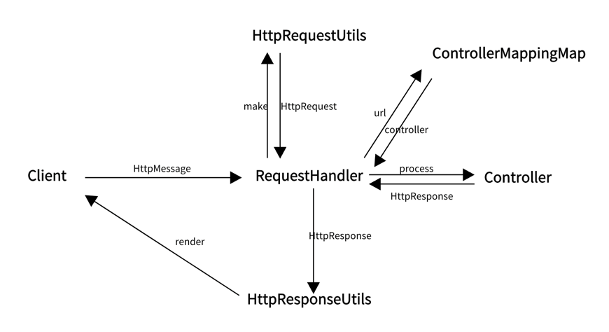

# java-was-2023

Java Web Application Server 2023

## 프로젝트 정보 

이 프로젝트는 우아한 테크코스 박재성님의 허가를 받아 https://github.com/woowacourse/jwp-was 
를 참고하여 작성되었습니다.

## 구조 설명

1. Client가 HttpMessage를 보내면 Webserver에서 생성된 thread를 통해 RequestHandler로 진입 
2. HttpRequestUtils에서 HttpMessage에 대한 parsing을 진행하고 HttpRequest 객체를 만들어서 반환
3. RequestUrl을 통해 ControllerMappingMap에 등록된 Controller를 찾아서 반환
4. HttpRequestUtils에서 반환된 HttpRequest와 RequestHandler에서 자체적으로 생성한 HttpResponse를 Controller에 넘겨주고 컨트롤러 자체 로직을 실행, Controller에서는 클라이언트에 반환할 값이 세팅된 HttpResponse 객체를 반환
5. 반환된 HttpResponse 객체를 HttpResponseUtils에 넘겨주고 해당 클래스에서 render를 통해 Client에게 Http 응답 메시지를 전송